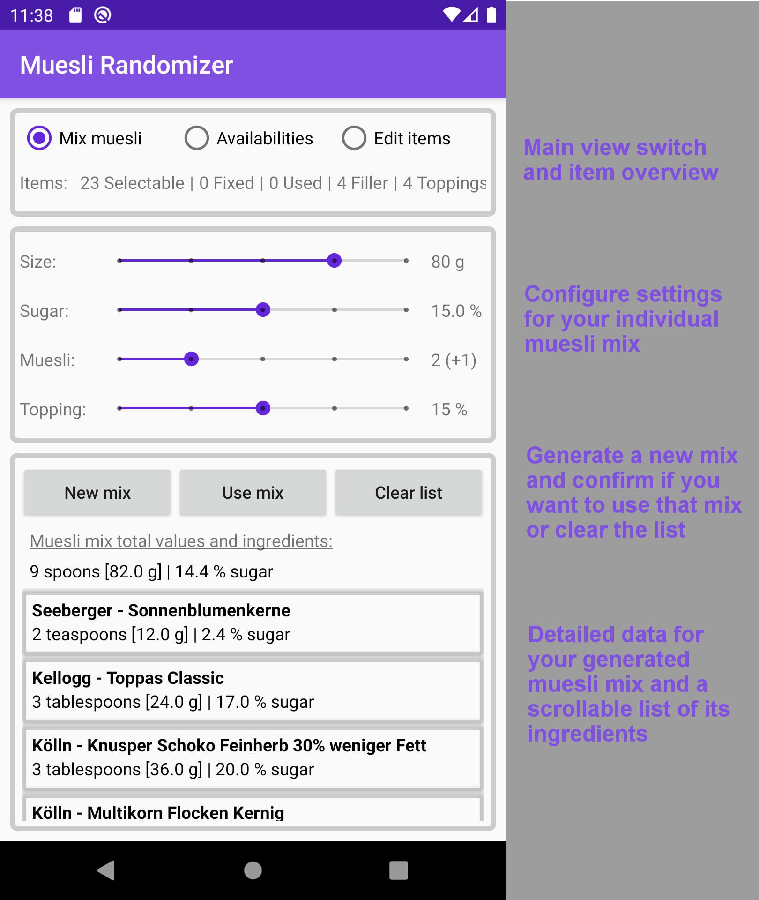
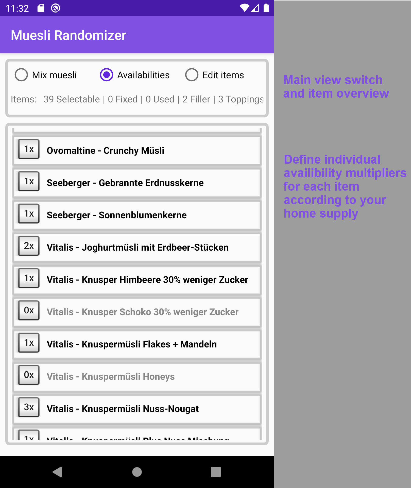
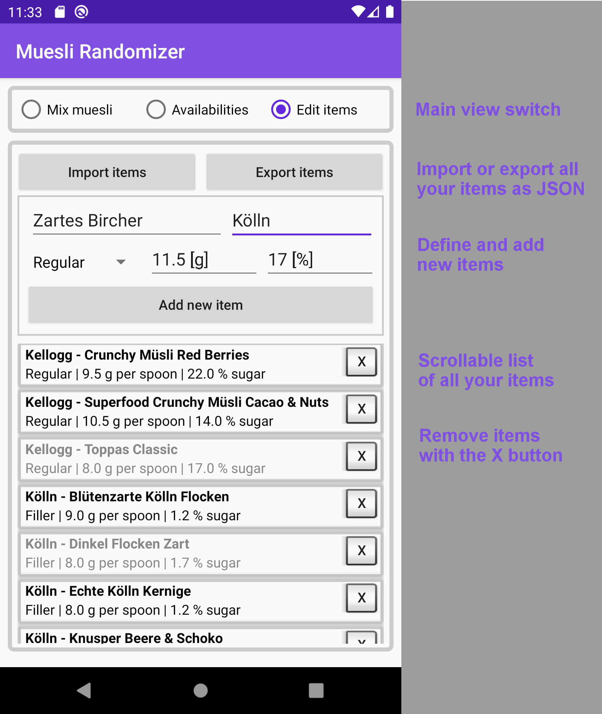

# Meal Suggestions
 
App to suggest a meal. Meals are picked from an exhaustible, recurring list.

An availibility multiplier (0x-3x) for each meal can be defined via a separate view. Data import/export (JSON) and addition/removal of items can be done via another view.

<table>
  <tr>
    <td>Regular meal suggestion view</td>
    <td>Availibility multiplier view</td>
    <td>Items editing view</td>
  </tr>
  <tr>
    <td></td>
    <td></td>
    <td></td>
  </tr>
</table>
